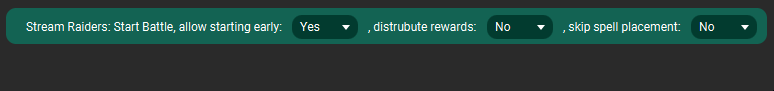
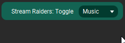
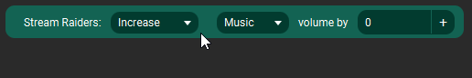
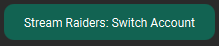

# TouchPortal StreamRaiders Plugin
Plugin for Touch Portal to interact with Stream Raiders

- [TouchPortal StreamRaiders Plugin](#touchportal-streamraiders-plugin)
- [Notice](#notice)
- [Changelog](#changelog)
- [Actions](#actions)
  - [Start Battle](#start-battle)
  - [Toggle Music/SFX Audio](#toggle-musicsfx-audio)
  - [Increase/Decrease Music/SFX volume by or to a specified value](#increasedecrease-musicsfx-volume-by-or-to-a-specified-value)
  - [Switch between Account Types - Captain or Viewer](#switch-between-account-types---captain-or-viewer)
- [States](#states)
  - [Account Type](#account-type)
  - [Battle State](#battle-state)
  - [Battle Timer Minutes](#battle-timer-minutes)
  - [Battle Timer Seconds](#battle-timer-seconds)
  - [Battle Time Left](#battle-time-left)
  - [Unit Count](#unit-count)
  - [Music Audio Status](#music-audio-status)
  - [SFX Audio Status](#sfx-audio-status)
  - [Music Audio Volume](#music-audio-volume)
  - [SFX Audio Volume](#sfx-audio-volume)
- [Example Page](#example-page)
  - [Dependencies](#dependencies)
  - [Versioning](#versioning)
  - [Authors](#authors)
  - [License](#license)
  - [Bugs/Enhancements](#bugsenhancements)
  - [Acknowledgments](#acknowledgments)

# Notice
This plugin is NOT developed by Stream Captain and is not affiliated with them in any way. Support will be provided through github issues or through the #stream-raiders channel on the [Official Touch Portal Discord](https://discord.gg/MgxQb8r)

This plugin also could stop working on future updates to Stream Raiders or their integration may change with stream deck and thus may render endpoints used by this plugin invalid. Please use github issues or the discord channel mentioned above to inform me if that seeems to happen.

# Changelog
```
1.0.0 - Initial Release
  Settings:
    - None Currently
  Actions:
    - Start Battle
    - Toggle Music/SFX Audio
    - Increase/Decrease Music/SFX volume by or to a specified value
    - Switch between Account Types - Captain or Viewer
  States:
    - Account Type
      Description: Current Account Type
      Valid Values: Captain, Viewer
    - Battle State
      Description: Current state of your current Stream Raiders Battle
      Valid Values: Waiting for New Raid, Unit On Cooldown, Unit Available, Unit Placement Period, Unit Placement Ending, Waiting for Captain to Start, Battle Started, Battle Rewards, Battle Ended
    - Battle Timer Minutes
      Description: Numeric representation of Battle Timer Minutes
    - Battle Timer Seconds
      Description: Numeric representation of Battle Timer Seconds
    - Battle Time Left
      Description: Numeric representation of Battle Placement Time Left in Seconds
    - Unit Count
      Description: Numeric representation of Unit Count
    - Music Audio Status
      Description: Indicator for Music Audio Status
      Valid Values: On, Off
    - SFX Audio Status
      Description: Indicator for SFX Audio Status
      Valid Values: On, Off
    - Music Audio Volume
      Description: Music Audio Volume
      Valid Values: 0 - 100
    - SFX Audio Volume
      Description: SFX Audio Volume
      Valid Values: 0 - 100
```

# Actions
 ## Start Battle
 
 ## Toggle Music/SFX Audio
 

 ## Increase/Decrease Music/SFX volume by or to a specified value
 
 ## Switch between Account Types - Captain or Viewer
 

# States
## Account Type
    Description: Current Account Type
    Id: streamraiders_account_type
    Valid Values: Captain, Viewer
## Battle State
    Description: Current state of your current Stream Raiders Battle
    Id: streamraiders_battle_state
    Valid Values: Waiting for New Raid, Unit On Cooldown, Unit Available, Unit Placement Period, Unit Placement Ending, Waiting for Captain to Start, Battle Started, Battle Rewards, Battle Ended
## Battle Timer Minutes
    Description: Numeric representation of Battle Timer Minutes
    Id: streamraiders_battle_timer_minutes
## Battle Timer Seconds
    Description: Numeric representation of Battle Timer Seconds
    Id: streamraiders_battle_timer_seconds
## Battle Time Left
    Description: Numeric representation of Battle Placement Time Left in Seconds
    Id: streamraiders_placement_timeLeft
## Unit Count
    Description: Numeric representation of Unit Count
    Id: streamraiders_unit_count
## Music Audio Status
    Description: Indicator for Music Audio Status
    Id: streamraiders_music_audio_status
    Valid Values: On, Off
## SFX Audio Status
    Description: Indicator for SFX Audio Status
    Id: streamraiders_sfx_audio_status
    Valid Values: On, Off
## Music Audio Volume
    Description: Music Audio Volume
    Id: streamraiders_music_audio_volume
    Valid Values: 0 - 100
## SFX Audio Volume
    Description: SFX Audio Volume
    Id: streamraiders_sfx_audio_volume
    Valid Values: 0 - 100

# Example Page
I built an example page that can be used to get you started

Download: [Touch Portal Stream Raiders Example Page](resources/streamraiders-example.tpz)
<br> <br>


## Dependencies
- [Stream Raiders](https://www.streamraiders.com/)
- [touchportal-api](https://www.npmjs.com/package/touchportal-api)
- [atob](https://www.npmjs.com/package/atob)
- [axios](https://www.npmjs.com/package/axios)
- [btoa](https://www.npmjs.com/package/btoa)
- [find-process](https://www.npmjs.com/package/find-process)
- [qs](https://www.npmjs.com/package/qs)
- [websocket](https://www.npmjs.com/package/websocket)

## Versioning

We use [SemVer](http://semver.org/) for versioning. For the versions available, see the [tags on this repository](https://github.com/spdermn02/tpohm_plugin/tags).

## Authors

- **Jameson Allen** - _Initial work_ - [Spdermn02](https://github.com/spdermn02)

## License

This project is licensed under the MIT License- see the [LICENSE](LICENSE) file for details

## Bugs/Enhancements
Use the Github Issues tab to report any bugs/enhancements for this plug-in. Or mention them in the Official Touch Portal discord channel #stream-raiders

## Acknowledgments

- Thank you to [Niterfx](https://www.twitch.tv/niterfx_) for inquiring about the plugin possiblities and coordinating communication to the Stream Captain team to make sure it was okay to build this plugin based on their Streamdeck plugin, and testing it!
- Thank you to [Tempestwins](https://www.twitch.tv/tempestwins) for testing
- Thank you to the Stream Captain team for allowing the plugin to be developed
- Thank you to Ty and Reinier for creating and developing Touch Portal